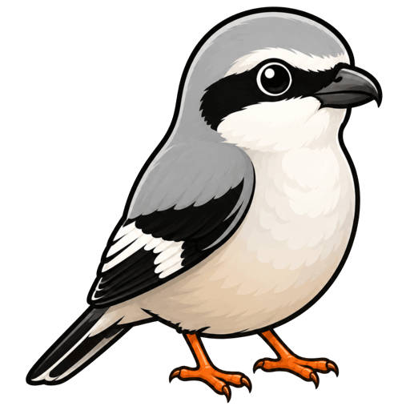
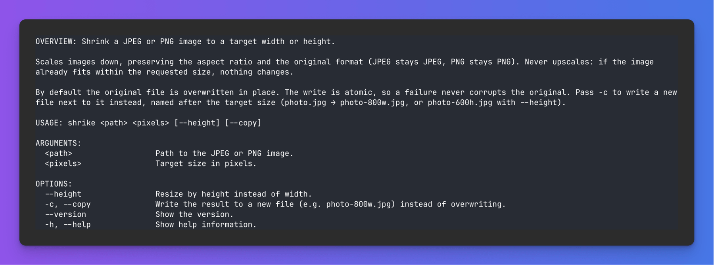

<h1 align="center">Shrike</h1>

<table>
  <tr>
    <td width="240" align="center" valign="top">
      
    </td>
    <td valign="middle">
      <strong>Shrike</strong> is a small macOS command-line tool that shrinks JPEG and PNG images to a target width or height, preserving the aspect ratio and the original format.
    </td>
  </tr>
</table>

<p align="center">
  
</p>


## Usage

```
shrike <path> <pixels> [--height] [-c | --copy]
```

```sh
shrike photo.jpg 800           # resize to 800px wide, overwrite in place
shrike photo.jpg 600 --height  # resize to 600px tall, overwrite in place
shrike photo.jpg 800 -c        # write photo-800w.jpg, leave the original alone
shrike photo.png 600 --height -c   # writes photo-600h.png
shrike --help
```

## Behavior

- **Shrink only.** If the image already fits within the requested size, nothing is resized (with `-c`, an unchanged copy is still written so the expected output file exists). Exit code is 0 either way.
- **Format is preserved.** JPEG stays JPEG, PNG stays PNG. Anything else (HEIC, WebP, …) is rejected, as is a file whose extension doesn't match its actual content.
- **Safe overwrites.** In-place mode writes the full result to a temporary file in the same directory, then swaps it in atomically — a crash or a full disk never corrupts the original.
- **EXIF orientation is handled.** Rotated camera photos come out upright; the orientation flag is reset so viewers don't rotate them a second time. Other metadata (EXIF dates, GPS, color profile) is preserved.
- **PNG transparency is preserved.** JPEGs are re-encoded at quality 0.85 — note that repeatedly resizing the same JPEG in place loses a little quality each time, which is inherent to the format.
- Copy names are deterministic (`photo.jpg` → `photo-800w.jpg` / `photo-600h.jpg`), so re-running the same command overwrites the same copy instead of piling up new files.

### Exit codes

| Code | Meaning |
|------|---------|
| 0    | Success, including the "already small enough" no-op |
| 2    | File or image error (missing file, unsupported/mismatched format, decode/write failure) |
| 64   | Usage error (bad arguments; standard `EX_USAGE` from swift-argument-parser) |

## Building and installing

Requires macOS 13+ and the Xcode Command Line Tools (Swift 5.9+). The only dependency is [swift-argument-parser](https://github.com/apple/swift-argument-parser), fetched automatically on the first build; image work uses the system ImageIO/CoreGraphics frameworks.

### 1. Build

Clone the repository and run the build from the project root — the directory containing `Package.swift`:

```sh
git clone https://github.com/carlosinho/shrike.git
cd shrike
swift build -c release
```

This produces a single self-contained binary at `.build/release/shrike`. It has no runtime dependencies, so it can be copied anywhere and run from there.

### 2. Install so it works from any directory

Your shell finds commands by searching the directories listed in `$PATH`, so to run `shrike` from anywhere, copy the binary into one of those directories. `/usr/local/bin` is on the default PATH of every macOS install:

```sh
sudo cp .build/release/shrike /usr/local/bin/
```

No-sudo alternative: if a user-writable directory such as `~/.local/bin` or `~/bin` is already on your PATH (check with `echo $PATH`), copy the binary there instead.

### 3. Verify

Open any directory and run:

```sh
which shrike     # should print the directory you copied the binary into
shrike --version
shrike ~/Desktop/some-photo.jpg 800 -c
```

Once installed, the project directory is no longer needed at runtime — the binary is standalone. It only matters again when you want to change the code: rebuild and re-copy (steps 1–2) to update the installed version.

### Running without installing

From the project root you can always run the tool directly:

```sh
.build/release/shrike photo.jpg 800
# or, slightly slower (checks whether a rebuild is needed first):
swift run shrike photo.jpg 800
```

## Tests

```sh
swift run shrike-tests
```

The test target is a plain executable with a minimal built-in harness, because the Command Line Tools toolchain ships neither XCTest nor Swift Testing (they come with full Xcode). It covers the dimension math, in-place and copy resizing, the no-upscale rule, EXIF orientation and metadata handling, PNG transparency, and the error paths.

## Known limitations (proof of concept)

- One file per invocation — no globs or directories.
- JPEG and PNG only.
- JPEG quality is fixed at 0.85 (no `--quality` flag yet).
- Requires the file extension (`.jpg`/`.jpeg`/`.png`, any case) to match the actual image content.

## Possible future features

None of these are implemented; they're natural next steps on the current foundation, roughly in order of usefulness:

- **Batch mode** — accept multiple paths or a directory (`shrike *.jpg 800 -c`), with a per-file summary and a nonzero exit if any file fails.
- **`--quality <0–1>`** — control JPEG re-encode quality instead of the fixed 0.85.
- **HEIC input** — ImageIO already decodes HEIC natively, so `shrike photo.heic 800` could work today; the main design question is whether the output stays HEIC or converts to JPEG.
- **`-o <path>`** — explicit output path as an alternative to the automatic `-800w` copy naming.
- **Fit-within-box mode** — a single `--max 1200` that constrains the longest edge, handy for mixed portrait/landscape batches.
- **`--strip-metadata`** — drop EXIF/GPS instead of preserving it, for images headed to the public web.
- **Shell completions** — swift-argument-parser can generate zsh/bash completion scripts (`shrike --generate-completion-script zsh`).
- **WebP output** — would need a third-party encoder; ImageIO doesn't write WebP.
